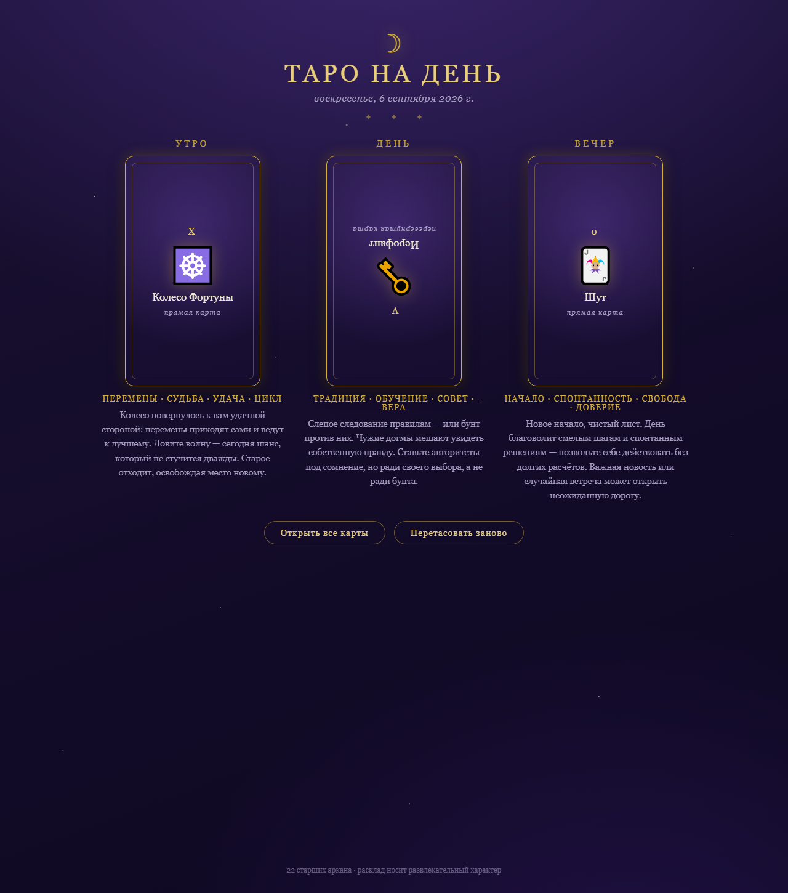

# Таро на день ✦

Компактное веб-приложение для ежедневного гадания: нажмите кнопку — откроется расклад из трёх карт (**Утро / День / Вечер**) с полной расшифровкой значений на русском языке.



## Возможности

- **22 старших аркана** — от Шута до Мира, с ключевыми словами и значениями в прямом и перевёрнутом положении
- **Расклад дня** — карты выбираются по дате, поэтому в течение суток расклад один и тот же (завтра будет новый)
- **Перевёрнутые карты** — каждая карта может выпасть в перевёрнутом положении со своим значением
- **Перетасовка** — альтернативный случайный расклад по запросу
- **Анимация переворота** карт, тёмная «мистическая» тема, адаптивная вёрстка для мобильных
- **Ноль зависимостей** — только встроенные модули Node.js, работает офлайн

## Запуск

Нужен только [Node.js](https://nodejs.org) (версия 14 или новее). Установка пакетов не требуется:

```bash
node server.js
```

Затем откройте [http://localhost:3000](http://localhost:3000).

Порт можно изменить переменной окружения `PORT`:

```bash
PORT=8080 node server.js   # Linux/macOS
set PORT=8080 && node server.js   # Windows
```

## Структура проекта

```
tarot-day/
├── server.js          # HTTP-сервер: статика + API (без зависимостей)
├── data/
│   └── tarot.js       # 22 аркана: названия, символы, значения
└── public/
    ├── index.html     # страница приложения
    ├── style.css      # оформление и анимации
    └── app.js         # логика клиента
```

## API

`GET /api/spread` — расклад дня (детерминирован по дате):

```json
{
  "date": "2026-09-06",
  "slots": ["Утро", "День", "Вечер"],
  "cards": [
    {
      "numeral": "X",
      "name": "Колесо Фортуны",
      "symbol": "☸️",
      "isReversed": false,
      "keywords": ["перемены", "судьба", "удача", "цикл"],
      "upright": "…",
      "reversed": "…"
    }
  ]
}
```

`GET /api/spread?shuffle=1` — случайный расклад.

---

*Проект носит развлекательный характер.* ✦
